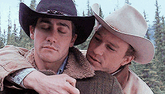

#### Arc: Rowan Rescue
#### PCs: [Avalon](PCs/Current/Avalon.md), [India](PCs/Current/India.md), [Stalfor](PCs/Current/Stalfor.md), [Harland](PCs/Current/Harland.md)

# Session 102 Notes

## Neverwinter
- First Power Word Kill of the campaign from [Harland](PCs/Current/Harland.md), PWK-ing cultist guy
- [Harland](PCs/Current/Harland.md) cast Detect Thoughts on the guy with the fire halo
	- Cult - part of what has been occupying his mind for a long time is their cult's scrying resources have been spent trying to find [Avalon](PCs/Current/Avalon.md)'s amulet
		- Wielder (Avalon) has been on the move, posting up in major cities in case she appears there (Neverwinter convenient)
	- Overwhelming feeling of admiration for this person's deity - they attribute all their power to Kossuth 
		- They see the Amulet as a way to gain more power and favour with Kossuth
	- They know of a dormant power housed in the amulet and are unsure if it's been unlocked or not
- Searched the bodies of the Heralds of the Flame, one of them carried a gold symbol of Kossuth.
- [Harland](PCs/Current/Harland.md) suggested [Avalon](PCs/Current/Avalon.md) try to connect emotionally with her amulet to see if she could unlock the power housed within
	- She felt something also reaching out within, trying to connect with her. Exhilarating!!!!!!!!
- Decided to step outside of city limits to do the Wish to summon the griffon riders and the griffons.
	- Cast the Wish:
> 		*I wish for a flight of fully equipped and trained griffons with griffon riders loyal to our cause to immediately arrive, prepared to safely transport our party, along with all our equipment and supplies, to the location on Mount Hotenow depicted on this map. This wish shall be performed by my intent and not my words.*

- Four griffons, each equipped with saddles and carrying equipment, and each with their own gnome rider, appeared prepared to take the party.
- [Harland](PCs/Current/Harland.md) and his rider got awfully close <3

	

<iframe style="border-radius:12px" src="https://open.spotify.com/embed/track/2QTDuJIGKUjR7E2Q6KupIh?utm_source=generator" width="100%" height="152" frameBorder="0" allowfullscreen="" allow="autoplay; clipboard-write; encrypted-media; fullscreen; picture-in-picture" loading="lazy"></iframe>
<iframe style="border-radius:12px" src="https://open.spotify.com/embed/track/5yyqx4brn6Bm9U1Rj9ENnz?utm_source=generator" width="100%" height="152" frameBorder="0" allowfullscreen="" allow="autoplay; clipboard-write; encrypted-media; fullscreen; picture-in-picture" loading="lazy"></iframe>

- While flying, [India](PCs/Current/India.md) and [Harland](PCs/Current/Harland.md) spotted more paths up the mountain either from carts or foot traffic.
- After hours of flying, we descended and landed on the blackened stone outcropping selected as our destination
	- Pilots helped us each dismount and returned our stowed equipment
- Set up camp for the night on the ledge and took long rests, [India](PCs/Current/India.md) took watch <3

## Mount Hotenow
- Entered the mountain via a path we found that entered the mountain. 
- Eventually came to a carved archway into the mountainside
- Beyond, saw the pathway open to a vast cavern carved into the mountainside with a colossal stone bridge stretching down the centre, over a bubbling pit of magma
- Took our potions of fire resistance, read our notes, [Avalon](PCs/Current/Avalon.md)'s said:
	>> *Don't forget to snack on something sweet -- fuel that brilliant head of yours! <3*
	
- Giant door at the end of the stone bridge, with symbols in Ignan, translates to "The true path is in flame"
- Along the path are statues of differernt powerful elemental creatures
	- Statues of elementals, ancient red dragons, basically powerful fire casters
- Magma mephits appeared and started attacking, then fire elementals appeared and we ended the session. [Harland](PCs/Current/Harland.md)'s turn to start next time!