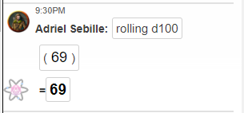

#### Arc: Forge of Fury
#### PCs: [Sylvia](PCs/Past/Sylvia.md), [India](PCs/Current/India.md), [Stalfor](PCs/Current/Stalfor.md), [Adriel](PCs/Current/Adriel.md)

# Notes
- Fought orcs and dire wolves
- [Adriel](PCs/Current/Adriel.md) unlocked the gate of the commoners, [Sylvia](PCs/Past/Sylvia.md) guided them out. Gave them all of her water and 1 day of rations each, as well as 3 of her daggers
- Named the group **"The Skinny Legends"**
- Explored the rest of the place, found a room with the following:
	- +1 rapier
	- 210 gp
	- topaz worth 200 gp
	- 2x onyx worth 50 gp each
	- 300 gp from sacks
	- Full helm with a second guard that swivels to cover mouth, **Vox Helm**. No attunement required.
		- Raise/lower guard as action
		- While lowered, voice sounds enhanced (masculinity/femininity/pitch etc.)

- [Adriel](PCs/Current/Adriel.md)'s Big Moment:

- Found secret door, easily cleared out the room. Three orcs chanting about Gruumsh, perhaps he is some sort of deity?
- Glowering dwarf's face on door
	- 8 spouts worked into stonework above the floor, set off fire trap when door opens
- Bats appeared, fought bats, tried door again and got burned again
- Said fuck it and went down the stairs