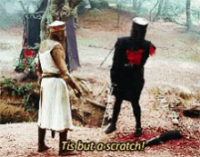
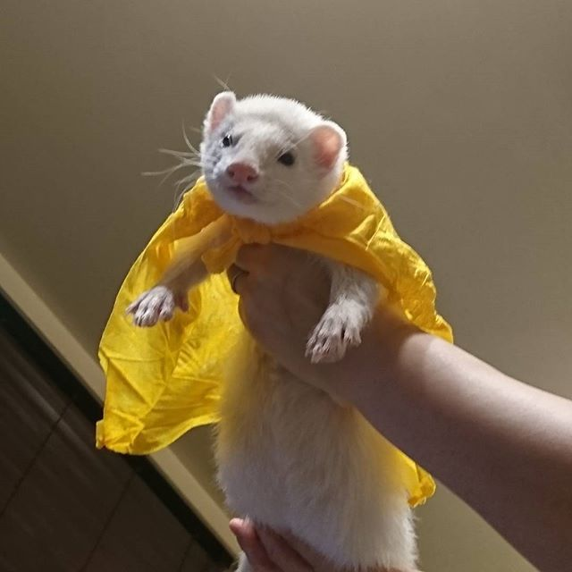
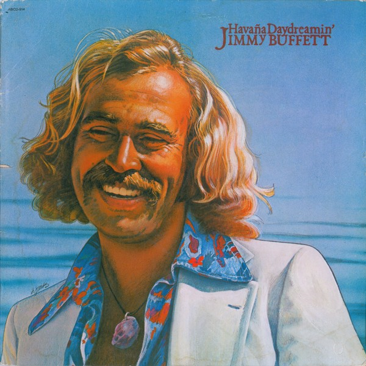

#### Arc: Unexpected Wedding
#### PCs: [Sylvia](PCs/Past/Sylvia.md), [India](PCs/Current/India.md), [Stalfor](PCs/Current/Stalfor.md), [Adriel](PCs/Current/Adriel.md)

# Notes
## Sylvan Retreat:
- "Mouse" is a half-orc who works at the Sylvan Retreat, only other patron at the tavern
- At night, a streak of light in sky that flares very brightly, fades away after a few moments (meteor???)
- Maud gave each of us a pack of berries and cheeses

- Left the inn and set out back on the road

- Gnome ran out from a hut and ran out to the middle of the road by a bridge and "Halt"
	- Demanded three riddles to be answered correctly to pass
	- It was actually a therapy session, and we ended up helping his sick kids
	- Fonkin Humplebumple, wife's name is Berry
- Found a meteorite that crashed down to earth
	- [Adriel](PCs/Current/Adriel.md) and [Stalfor](PCs/Current/Stalfor.md) hear squishing noise coming from the meteorite
	- Meteorite has almost split into two pieces, a fancy looking javelin that has split the rock and is embedded into the rock behind it
		- Javelin: one end is barbed, other end has symbol of a sun
	- [Sylvia](PCs/Past/Sylvia.md) grabbed the javelin and a very large tentacled creature (pentapus) made itself visible and grappled her, nearly killed her in one round

- [India](PCs/Current/India.md) is a middle child, three sisters and one brother
	- Writes to her parents every month
	- [Rita](NPCs/Living/Rita.md) (second eldest) adventures too, ranger(?), says she does archery
- Eventually began to reach Argentis Falls, part of Eastern Faraway. Wedding is at Silver Lodge in Argentis Falls
- Found an inn named "Hillside Haven" to rest for the night
- Moved on, found a man strumming a lyre by a fire with a sign saying "Lover's Apothecary"
	- He had weasel with scarf
	- Bought some items from him, he had very cool potions

- Later on the road we came across a turned over carriage with a panicked horse
	- [Adriel](PCs/Current/Adriel.md) spoke with the horse and learned they were attacked with spears and arrows
	- [Adriel](PCs/Current/Adriel.md) calmed down the horse and told him to wait by Hercules and Atlas
	- An elven man in a tropical floral cloak and big bushy moustache stumbled out of the forest and recognized [India](PCs/Current/India.md) ([[James]] Bouffay)

